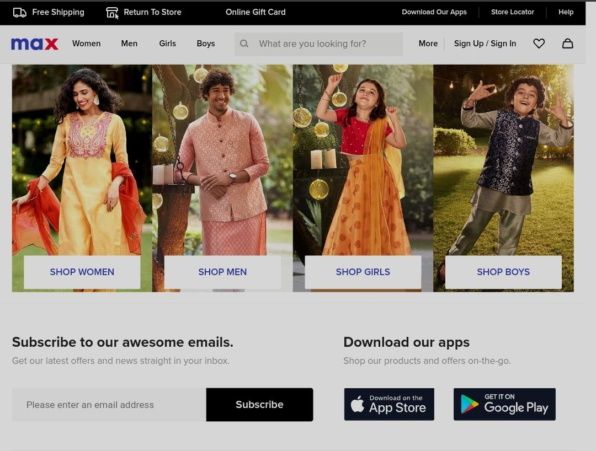
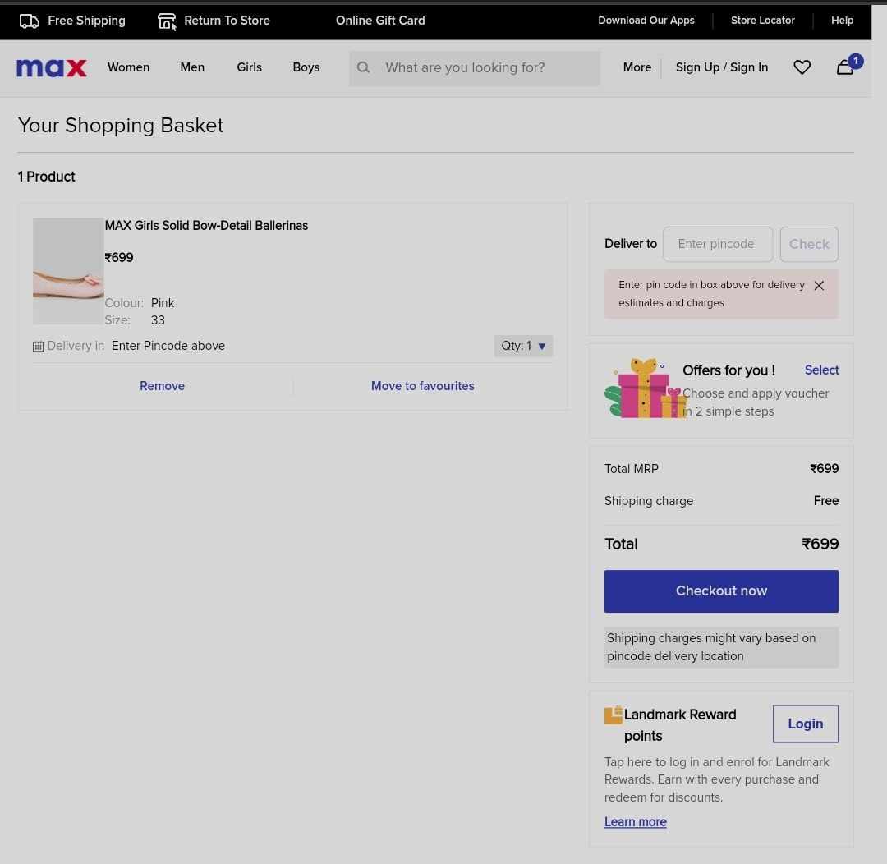
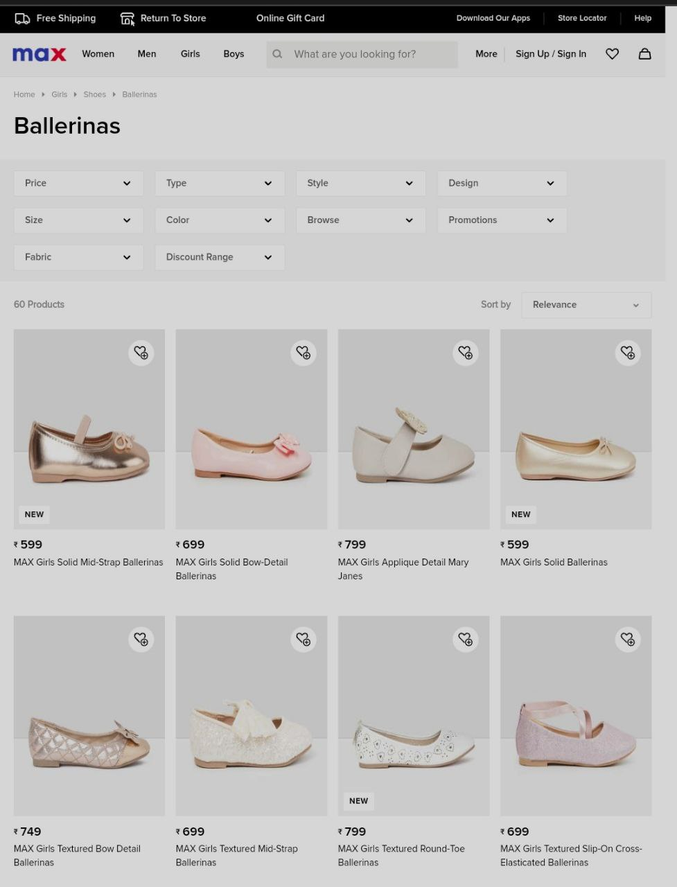

# Max-Clone-Website
Pixel Perfect Clone Of Max Website

Features:
Local Sign-in/Sign-up.
Responsive Design.
Functional User Interface.
All Products Mentioned

Tech Stack: HTML | CSS | Javascript | Bootstrap | React

Areas Of Responsibility:
Worked closely with the team to optimize and implement the
frontend.
Set deadlines and project milestones for the team.
Authenticated payment system.
Developed a responsive website for all screen sizes.
Different pages based on different category
See more details about item

A collaborative project built by a team of 5 executed in 7 days..

LIVE DEMO:  https://leafy-sorbet-dccc4d.netlify.app/

## Some of the screenshots are below:-

